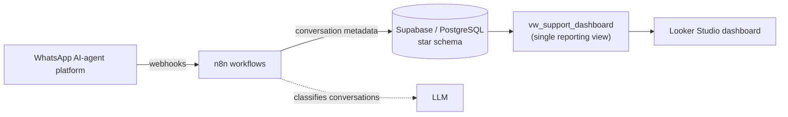

# Startup Support Dashboard

Support KPI dashboard for a WhatsApp AI-agent platform.
**WhatsApp platform → webhooks → n8n → Supabase (PostgreSQL star schema) → Looker Studio.**

## Overview

This project automates the first-level (L1) support KPIs of a WhatsApp support operation, so statements like *"40% of yesterday's tickets were about billing"* come straight from data instead of spreadsheets.

It is both a portfolio project and a **replicable template**: every new client gets its own database, its own pipeline and its own report, all created from the scripts in this repository.

**KPIs tracked:** First Response Time (FRT), Average Response Time (ART), Average Handle Time (AHT), SLA compliance, CSAT, volume by category, and AI-only vs. handoff vs. human-only handling.

## Architecture



Key design decisions:

- **Star schema** with dimension tables (agents, channels, categories, targets, ...) and fact tables (conversations, messages, CSAT responses).
- **One reporting view.** `vw_support_dashboard` has one row per conversation protocol (closed and backlog). Looker Studio connects only to this view, so every global filter applies to every chart.
- **Ratios are calculated in the BI layer**, not in the database, so SLA % and CSAT % stay correct under any combination of filters.
- **Privacy by design.** Message text is never stored, only metadata.
- **Categories are data.** New categories are added with a plain `INSERT`; the classification workflow reads them dynamically, with no workflow changes.
- **One Supabase project per client** (no multi-tenancy), which keeps data isolated and the template simple.

## Repository structure

```
3-startup-support-dashboard/
├── README.md
├── sql/
│   ├── full_project_setup.sql            # master script: schema, RLS, reference data, view, optional demo data
│   └── create_vw_support_dashboard.sql   # standalone script for the reporting view
├── workflows/                            # n8n workflow exports
└── docs/images/                          # dashboard screenshots (to add)
```

## Getting started

**Prerequisites:** an empty Supabase project, an n8n instance and a Google account for Looker Studio.

### 1. Database (Supabase)

Open the Supabase **SQL Editor**, paste the contents of `sql/full_project_setup.sql` and run it. The script has six sections:

| Section | Content | Required |
|---|---|---|
| 1 | Dimension tables | Yes |
| 2 | Fact tables | Yes |
| 3 | Row Level Security enabled on every table (no policies) | Yes |
| 4 | Reference data: macro categories, detractor reasons, KPI targets, example categories | Yes |
| 5 | Reporting view `vw_support_dashboard` | Yes |
| 6 | Demo data: 636 fictitious conversations with messages and CSAT responses | Optional |

- **Real client:** select the text from the top of the file down to the line `END OF SECTION 5` and click **Run** (the editor runs the selected text).
- **Demo / portfolio:** run the whole file.

Run it on an empty project only. Both parts end with a quick-check query that confirms the expected row counts.

### 2. Workflows (n8n)

Import the workflow exports from `workflows/` into n8n (*Workflows → Import from file*) and set your own credentials: database, LLM API key and webhook URLs.

### 3. Dashboard (Looker Studio)

Create a data source with the **PostgreSQL** connector pointing at the Supabase database (use the session pooler connection with SSL) and select the view `vw_support_dashboard`.

| Metric | Formula |
|---|---|
| Closed conversations | `SUM(is_closed)` |
| Backlog | `SUM(is_backlog)` |
| SLA % | `SUM(sla_met_flag) / COUNT(sla_met_flag)` |
| Date dimension | `reference_date` |

The SLA target is 80% of first responses within 600 seconds (stored in `dim_targets`). CSAT % is calculated in Looker Studio from `csat_value`.

## Dashboard

<!-- TODO: add screenshots to docs/images/ and uncomment the lines below.

-->

**Status**

- Operation page: built (volume, SLA, CSAT, category breakdown, Pareto by contact reason, AI / handoff / human split, global filters and a Day / Week / Month granularity selector).
- Time and Quality page, Agent Performance page: planned.

## Before going live with a new client

- **Replace the example categories** in section 4 of `sql/full_project_setup.sql` with the client's own. Keep the fallback category `Outros`.
- **Check the time zone.** The view's `reference_date` uses `America/Sao_Paulo`; change it if the client operates elsewhere.
- **Harden database access.** The pilot reads through the database owner. Before production, create a read-only database role for Looker Studio and move the view to a schema that is not exposed through the Supabase API.
